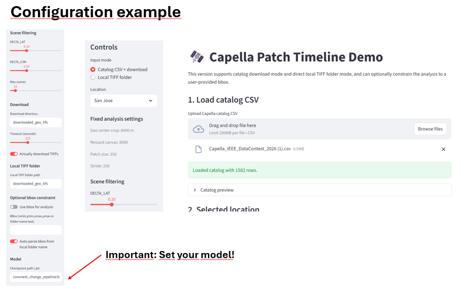
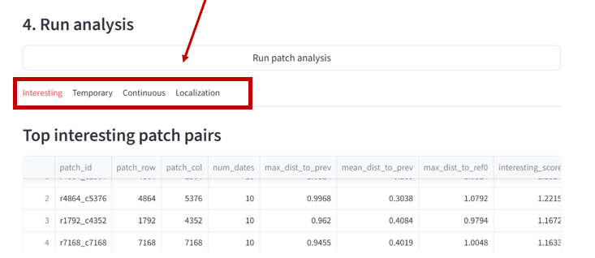
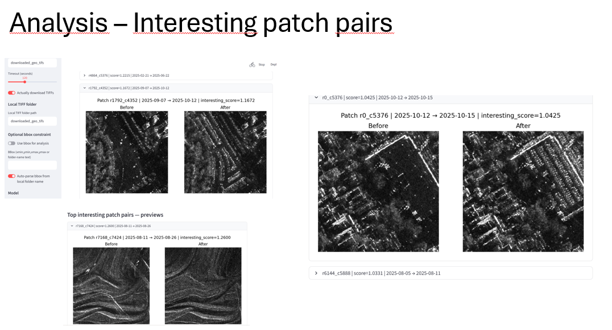
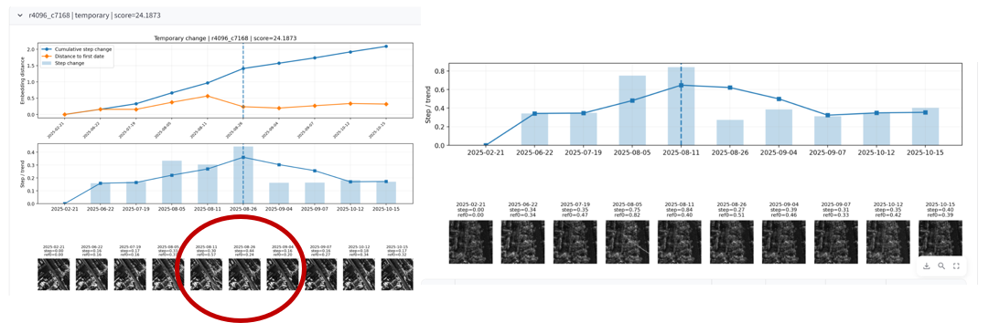
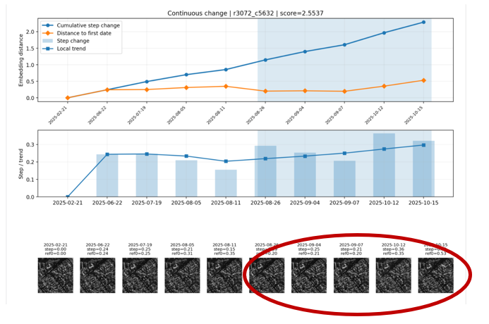
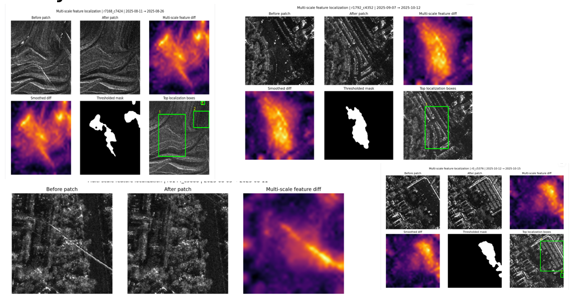

# TRISAR Demo

This document presents the main capabilities of the TRISAR demo application.

The demo was designed to support interactive exploration of temporal SAR image sequences and model outputs. It helps the user inspect spatial content, compare temporal behavior across dates, and identify suspicious regions and events.

## 1. Configuration

The demo interface allows the user to configure the main analysis parameters before running exploration.

Typical configuration options include:
- model checkpoint path,
- input TIFF directory,
- CSV or metadata paths,
- location selection,
- patch size,
- stride,
- temporal scoring parameters,
- localization thresholds.
- other ... see: trisar_app.py

### Example

The configuration panel makes it possible to quickly adapt the analysis to different datasets and checkpoints.

## 2. Analysis

The analysis module provides an interactive way to inspect SAR scenes and compare temporal samples.

It can be used to:
- view selected regions,
- inspect suspicious pairs,
- analyze temporal rankings,
- analyze continuous/gradual changes
- compare embeddings across dates.

### Example

This view gives an overview of the selected region and the model-driven interpretation of its temporal behavior.

## 3. Interesting pairs

## 3. Temporary Changes

One important goal of TRISAR is to identify **temporary changes**, meaning abrupt deviations that appear at one time point and later disappear.

These events may correspond to:
- transient scene activity,
- temporary object presence,
- acquisition-related instability,
- short-lived visual anomalies.

### Example

The timeline view helps distinguish these short-duration events from more stable temporal processes.

## 4. Continuous Changes

The framework also supports the interpretation of **continuous changes**, where the scene evolves gradually over multiple acquisitions.

These changes are typically more consistent with:
- meaningful scene development,
- persistent structural evolution,
- progressive land-cover or surface change.

### Example

This view is especially useful for identifying regions with steady temporal drift rather than isolated anomalies.

## 5. Localization

TRISAR includes a localization component that highlights the compact spatial regions most responsible for suspicious behavior.

This helps the user move beyond a global patch score and inspect the actual area that may explain the anomaly.

### Example

The localization output supports better interpretability and more focused manual inspection.

## Summary

The demo application was designed to support:
- interactive configuration,
- scene and timeline analysis,
- temporary change interpretation,
- continuous change interpretation,
- suspicious region localization.

Together, these components provide an effective interface for exploring temporal SAR behavior with the TRISAR framework.